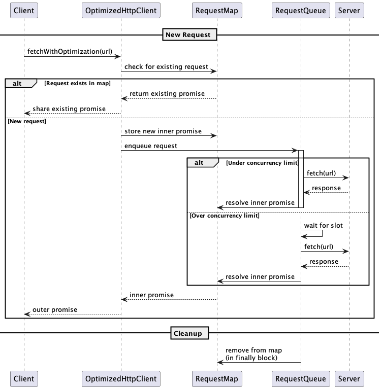

# OptimizedHttpClient

The `OptimizedHttpClient` is a TypeScript class designed to manage HTTP requests with optimizations such as deduplication of identical requests and limiting the number of concurrent requests to a specific host.

## Features

- **Request Deduplication**: Prevents multiple identical requests from being sent simultaneously by reusing the response of the first request.
- **Concurrency Management**: Limits the number of concurrent requests to a specific host, queuing additional requests until earlier ones complete.

## Installation

To use the `OptimizedHttpClient`, ensure you have the necessary dependencies installed:

```bash
npm install async node-fetch@2
```

> **Note**
> This project uses `node-fetch@2` to avoid issues with the built-in `fetch` function in Node.js which caused trouble with the jest mock. A future version of this library will use the built-in `fetch` function.

## Usage

Here's a basic example of how to use the `OptimizedHttpClient`:

```typescript
import { httpClient } from './path/to/httpClient';

async function fetchData() {
  const url = 'https://example.com/api/data';

  try {
    const data = await httpClient.fetchWithOptimization(url);
    console.log('Data received:', data);
  } catch (error) {
    console.error('Error fetching data:', error);
  }
}

fetchData();
```

## API

### `fetchWithOptimization(url: string, options?: RequestInit): Promise<any>`

Fetches data from the specified URL with optimizations.

- **Parameters**:

  - `url`: The URL to fetch data from.
  - `options`: Optional request options (e.g., headers, method).

- **Returns**: A promise that resolves with the parsed data.

- **Example**:

  ```typescript
  const url = 'https://example.com/api/data';
  const options = {
    headers: {
      Authorization: 'Bearer your-token',
    },
  };

  httpClient
    .fetchWithOptimization(url, options)
    .then((data) => console.log(data))
    .catch((error) => console.error(error));
  ```

## Behavior Under Load

The `OptimizedHttpClient` is designed to handle various forms of load efficiently:

- **High Frequency of Identical Requests**: When multiple identical requests are made, the client deduplicates them, ensuring only one request is sent to the server. Subsequent requests receive the same response as the first, reducing server load and network traffic.

- **High Concurrency**: The client limits the number of concurrent requests to a specific host to a maximum of three. This prevents overwhelming the server and ensures that requests are processed in a controlled manner. Additional requests are queued and processed as earlier requests complete.

- **Queue Management**: Requests that exceed the concurrency limit are queued and processed in the order they were received. This ensures fair and predictable handling of requests under heavy load.

## Limitations

- **GET Requests Only**: The `OptimizedHttpClient` is designed to handle only HTTP GET requests. It does not support other HTTP methods such as POST, PUT, DELETE, etc.

- **No Caching**: The client does not implement any caching mechanism. Each request is sent to the server without storing responses for future use.

- **No Authentication Handling**: While you can pass authentication headers in the request options, the client does not provide built-in support for handling authentication flows.

## Testing

The `OptimizedHttpClient` includes both unit and integration tests to ensure its functionality. To run the unit tests, use the following command:

```bash
npm test
```

To run the integration tests, use the following command:

```bash
npm run test:integration
```

### For the curious: Use of the Queue and the Promise Handling Mechanism

The client uses a sophisticated inner/outer promise pattern to manage request deduplication and cleanup:



1. **Request Deduplication**

   - An inner promise is stored in a map of in-flight requests
   - Duplicate requests reuse this stored promise instead of creating new queue entries
   - This ensures identical concurrent requests share the same underlying network call

2. **Proper Cleanup**

   - The inner promise is resolved/rejected when the actual network request completes
   - Cleanup of in-flight requests happens in the queue worker's finally block
   - This ensures proper resource management regardless of request success or failure

3. **Promise Chain Isolation**
   - The outer promise provides a clean interface to callers
   - Error handling is isolated, preventing issues with one request from affecting others
   - This pattern maintains reliability when handling multiple concurrent requests

## Contributing

Contributions are welcome! Please feel free to submit a pull request or open an issue if you have any suggestions or improvements.

## License

This project is licensed under the MIT License.
